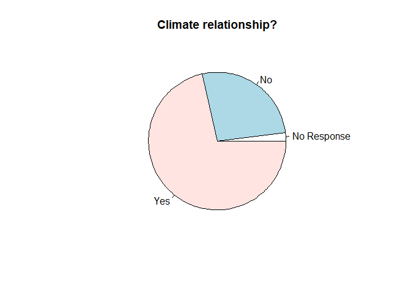
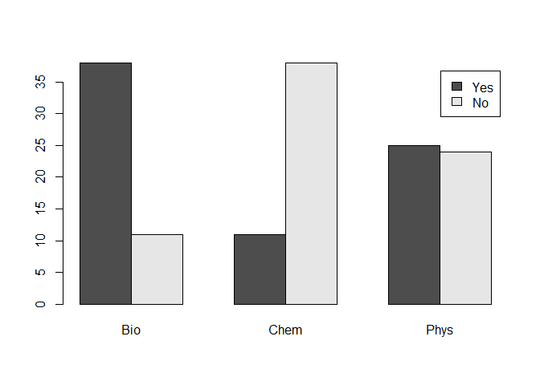

Initial\_Explore
================

## Initial exploration of EWE data for Eco-DAS Extreme Events project

AGH, 13Nov19

Load data and toolboxes. Create dataset that includes single unique
accessions

``` r
pacman::p_load(tidyverse,ggplot2)

data <- read.csv('C:/Users/ahoun/Dropbox/EWE/EWE/Data/CleanedExtremeEventsData_8Nov2019.csv')
data_uni <- distinct(data,UniqueAccession,.keep_all=TRUE)
data_uni <- data_uni[-50,]
```

## Are these studies linking to climate?

First count responses as ‘y’ and ‘n’

``` r
climate <- data_uni %>% group_by(Climate_relationship) %>% tally()
```

## Plot as a pie chart

<!-- -->

## What parameters are these studies measuring?

Biological? Physical? Chemical? Used whether Raw Data was available for
each category: would need to update for actual
analysis\!

``` r
bio <- data_uni %>% group_by(BiologicalResponse_RawData_PublicallyAvailable) %>% tally()
chem <- data_uni %>% group_by(ChemicalResponse_RawData_PublicallyAvailable) %>% tally()
phys <- data_uni %>% group_by(PhysicalResponse_RawData_PublicallyAvailable) %>% tally()
ana <- matrix(c(38,11,25,11,38,24),ncol=3,byrow=TRUE)
colnames(ana) <- c("Bio","Chem","Phys")
rownames(ana) <- c("Yes","No")
```

## Plot as a bar chart

<!-- -->
