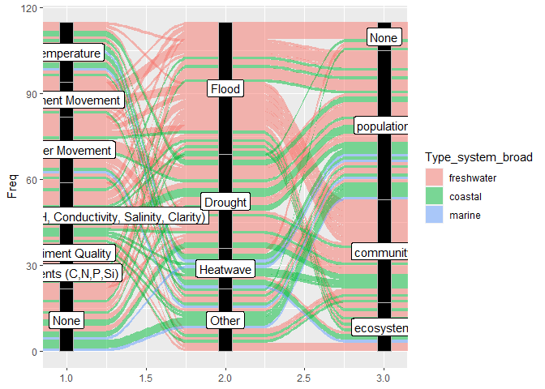

ResponseVariables
================
AGH
10Mar20

## Following E. Larson Combined Alluvial Plot

Used CSV file that had: 1. Completely filled in
ChemicalResponse\_Category, ChemicalResponse\_Measured, and
ChemicalResponse\_ElementMaterial\_Measured 2. Included pH as a
ChemicalResponse\_ElementMaterial\_Measured 3. Removed ‘water quality’
under ChemicalResponse\_Category and ‘combined response’ from
ChemicalResponse\_ElementMaterial\_Measured 4. Changed
PhysicalResponseMeasured to ‘Air temperature’ or ‘Water temperature’

Load data and clean-up (a bit\!)

``` r
pacman::p_load(tidyverse,ggplot2,dplyr,ggalluvial)

EEdata <- read.csv('C:/Users/ahoun/Dropbox/EWE/EWE/Data/CleanedExtremeEventsData_04Dec2019.csv')
```

## Manipulating the system type and event type. (From EL)

``` r
EEdata$Type_system_broad <- factor(rep(NA,length(EEdata$Type_system)),
                                   levels=c("freshwater","coastal","marine"))
EEdata$Type_system_broad[EEdata$Type_system %in% c("catchment/watershed","floodplain","lake","pond","stream/river","wetland")] <- "freshwater"
EEdata$Type_system_broad[EEdata$Type_system %in% c("estuary","lagoon","marine intertidal")] <- "coastal" 
# question if "coastal ocean" is coastal or marine - the only paper in this category looked at subtidal algae beds
EEdata$Type_system_broad[EEdata$Type_system %in% c("coastal ocean","deep sea","open ocean")] <- "marine"
# given there are so few marine events, maybe better to combine coastal and marine categories

EEdata$ProximateEvent_Type_broad <- factor(rep(NA,length(EEdata$ProximateEvent_Type)),
                                           levels=c("Flood","Drought","Heatwave","Other"))
EEdata$ProximateEvent_Type_broad[EEdata$ProximateEvent_Type %in% c("Flood")] <- "Flood"
EEdata$ProximateEvent_Type_broad[EEdata$ProximateEvent_Type %in% c("Drought")] <- "Drought"
EEdata$ProximateEvent_Type_broad[EEdata$ProximateEvent_Type %in% c("Heatwave")] <- "Heatwave"
EEdata$ProximateEvent_Type_broad[is.na(EEdata$ProximateEvent_Type_broad)] <- "Other"
```

## Manipulating the biological response variable (from EL)

``` r
EEdata$OrgLevel <- factor(rep(NA,length(EEdata$BiologicalResponseMeasured)),
                                   levels=c("population", "community", "ecosystem"))

EEdata$OrgLevel[EEdata$BiologicalResponseMeasured %in% c("annual biomass","aboveground biomass","belowground biomass","biomass","summer biomass", "EVI")] <- "ecosystem"

EEdata$OrgLevel[EEdata$BiologicalResponseMeasured %in% c("abundance","annual abundance", "catches or landings", "density", "percent occurrence", "occupancy rate", "percent cover", "summer abundance", "annual Year of Young", "summer Year of Young", "population size structure",  "male survival", "reproduction - nest quantity", "reproduction - ovulation rate", "reproduction - young survival", "body condition", "diet", "growth",  "infection rate", "leaf carbon isotope ratio", "metabolism", "mortality", "ratio of leaf chlorophyl a:b", "rhizome starch levels", "rhizome sugar level", "seawater readiness", "stomach fullness", "stress - cortisol level", "total leaf chlorophyl", "behavior - movement", "carbon assimilation")] <- "population"


EEdata$OrgLevel[EEdata$BiologicalResponseMeasured %in% c("annual evenness", "annual richness", "diversity", "functional beta diversity", "functional community structure","phenotypic diversity", "species evenness", "species richness", "summer evenness", "summer richness", "taxonomic beta diversity", "taxonomic diversity", "taxonomic richness", "macroinvertebrate community index", "community composition", "foodweb structure",  "taxonomic community structure", "stability and persistence", "colonization rate", "extinction rate")] <- "community"
```

## Manipulating the physical response (from EL)

``` r
EEdata$PhysBroadType <- factor(rep(NA,length(EEdata$PhysicalResponseMeasured)),
                                   levels=c("Temperature", "Sediment Movement", "Water Movement", "Water Quality (DO, pH, Conductivity, Salinity, Clarity)", "Sediment Quality", "Nutrients (C,N,P,Si)"))

EEdata$PhysBroadType [EEdata$PhysicalResponseMeasured %in% c(" water temperature","water temperature", "air temperature")] <- "Temperature"

EEdata$PhysBroadType [EEdata$PhysicalResponseMeasured %in% c("channel form","sediment transport","denudation rate","sediment")] <- "Sediment Movement"

EEdata$PhysBroadType [EEdata$PhysicalResponseMeasured %in% c("current speed","river flow","salinity","streamflow","water level","water retention time","water connectivity", "swash time","swash zone","wave height","wave period")] <- "Water Movement"

EEdata$PhysBroadType [EEdata$PhysicalResponseMeasured %in% c("dissolved oxygen","DO","pH", "turbidity","TSS/sediment","Conductivity","Salinity" )] <- "Water Quality (DO, pH, Conductivity, Salinity, Clarity)"

EEdata$PhysBroadType [EEdata$PhysicalResponseMeasured %in% c("sediment - grain size","sediment - organic matter","soil moisture")] <- "Sediment Quality"

EEdata$PhysBroadType [EEdata$PhysicalResponseMeasured %in% c("N-NH4","N-NO2","N-NO3 (includes NO3+NO2)","N-TN","P-SRP/PO4","P-TP","SiO2","C-CO2","C-DIC","C-DOC","C-POC")] <- "Nutrients (C,N,P,Si)"
```

## Manipulating the chemical response variable (from EL)

``` r
EEdata$ChemBroadType <- factor(rep(NA,length(EEdata$ChemicalResponse_ElementMaterial_Measured)),
                                   levels=c("Temperature", "Sediment Movement", "Water Movement", "Water Quality (DO, pH, Conductivity, Salinity, Clarity)", "Sediment Quality", "Nutrients (C,N,P,Si)"))

EEdata$ChemBroadType [EEdata$ChemicalResponse_ElementMaterial_Measured %in% c(" water temperature","water temperature", "air temperature")] <- "Temperature"

EEdata$ChemBroadType [EEdata$ChemicalResponse_ElementMaterial_Measured %in% c("channel form","sediment transport","denudation rate","sediment")] <- "Sediment Movement"

EEdata$ChemBroadType [EEdata$ChemicalResponse_ElementMaterial_Measured %in% c("current speed","river flow","salinity","streamflow","water level","water retention time","water connectivity", "swash time","swash zone","wave height","wave period")] <- "Water Movement"

EEdata$ChemBroadType [EEdata$ChemicalResponse_ElementMaterial_Measured %in% c("dissolved oxygen","DO","pH", "turbidity","TSS/sediment","Conductivity","Salinity" )] <- "Water Quality (DO, pH, Conductivity, Salinity, Clarity)"

EEdata$ChemBroadType [EEdata$ChemicalResponse_ElementMaterial_Measured %in% c("sediment - grain size","sediment - organic matter","soil moisture")] <- "Sediment Quality"

EEdata$ChemBroadType [EEdata$ChemicalResponse_ElementMaterial_Measured %in% c("N-NH4","N-NO2","N-NO3 (includes NO3+NO2)","N-TN","P-SRP/PO4","P-TP","SiO2","C-CO2","C-DIC","C-DOC","C-POC")] <- "Nutrients (C,N,P,Si)"
```

## Simplifying the dataframe (from EL)

``` r
EEdata_simple <- EEdata %>% 
  select(UniqueAccession, ProximateEvent_Type_broad, Type_system_broad, OrgLevel, PhysBroadType, ChemBroadType)
```

## Separate out Bio, Phys, and Chem parameters and remove duplicate values (i.e., if studies measured more than one ‘ecosystem’ response, this is set to one instead of two)

``` r
EEbio <- EEdata_simple %>% select(UniqueAccession,ProximateEvent_Type_broad,Type_system_broad,OrgLevel)
EEbio <- EEbio[complete.cases(EEbio),]

EEbio_dups <- EEbio %>% distinct()


EEphys <- EEdata_simple %>% select(UniqueAccession,ProximateEvent_Type_broad,Type_system_broad,PhysBroadType)
EEphys <- EEphys[complete.cases(EEphys),]

EEphys_dups <- EEphys %>% distinct()


EEchem <- EEdata_simple %>% select(UniqueAccession,ProximateEvent_Type_broad,Type_system_broad,ChemBroadType)
EEchem <- EEchem[complete.cases(EEchem),]

EEchem_dups <- EEchem %>% distinct()
```

## Combine Chem and Phys data into one matrix - will ultimately combine for alluvium plot; removed duplicate values (for Chem and Phys to eliminate double counting)

``` r
EEchem_dups <- EEchem_dups %>% rename(PhysBroadType = ChemBroadType)

EEphyschem_dups <- rbind.data.frame(EEchem_dups,EEphys_dups)

EEphyschem_dups <- EEphyschem_dups %>% arrange(UniqueAccession) %>% distinct()
```

## Merge PhysChem and Bio dataframes - note: this will result in double counting\!

``` r
EEall <- merge(EEphyschem_dups,EEbio_dups,by=c("UniqueAccession","ProximateEvent_Type_broad","Type_system_broad"),all=TRUE,sort=TRUE)
# NOTE: Will double count parameters!
```

## Set NA values to ‘none’ to indicate this parameter was not collected

``` r
# For PhysChem parameters
levels <- levels(EEall$PhysBroadType)
levels[length(levels) + 1] <- "None"

EEall$PhysBroadType <- factor(EEall$PhysBroadType, levels = levels)
EEall$PhysBroadType[is.na(EEall$PhysBroadType)] <- "None"

# For Bio parameters
levels <- levels(EEall$OrgLevel)
levels[length(levels) + 1] <- "None"

EEall$OrgLevel <- factor(EEall$OrgLevel, levels = levels)
EEall$OrgLevel[is.na(EEall$OrgLevel)] <- "None"
```

## Count the frequency for each ‘alluvial’ category

``` r
EEcount <- rename(count(EEall, PhysBroadType,ProximateEvent_Type_broad,OrgLevel,Type_system_broad), Freq = n)
```

## Try out an alluvial plot? See reference: <https://cran.r-project.org/web/packages/ggalluvial/vignettes/ggalluvial.html>

    ## Warning in to_lodes_form(data = data, axes = axis_ind, discern =
    ## params$discern): Some strata appear at multiple axes.
    
    ## Warning in to_lodes_form(data = data, axes = axis_ind, discern =
    ## params$discern): Some strata appear at multiple axes.
    
    ## Warning in to_lodes_form(data = data, axes = axis_ind, discern =
    ## params$discern): Some strata appear at multiple axes.

<!-- -->
