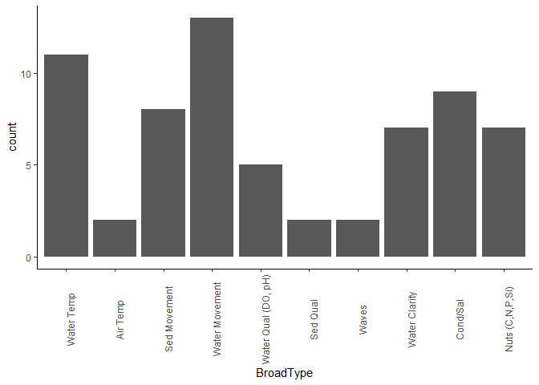

ResponseVariables\_ChemPhys
================
AGH
04Dec19

## Following E. Larson Bio Response Info.

Used CSV file that had: 1. Completely filled in
ChemicalResponse\_Category, ChemicalResponse\_Measured, and
ChemicalResponse\_ElementMaterial\_Measured 2. Included pH as a
ChemicalResponse\_ElementMaterial\_Measured 3. Removed ‘water quality’
under ChemicalResponse\_Category and ‘combined response’ from
ChemicalResponse\_ElementMaterial\_Measured 4. Changed
PhysicalResponseMeasured to ‘Air temperature’ or ‘Water temperature’

Load data and clean-up (a bit\!)

``` r
pacman::p_load(tidyverse,ggplot2)

data <- read.csv('C:/Users/ahoun/Dropbox/EWE/EWE/Data/CleanedExtremeEventsData_04Dec2019.csv')
data_2 <- data[,1:47]
```

## Subset data: studies that include Chem data; Phys data; and Chem+Phys data

``` r
data_Phys<-subset(data_2, PhysicalResponseCategory!="")
data_Chem<-subset(data_2, ChemicalResponse_Category!="")
data_cp <- subset(data_2, PhysicalResponseCategory!="" | ChemicalResponse_Category!="")
```

## Select subset of Phys and Chem data (to be used in plotting) then use rbind to combine phys and chem data together

``` r
data_Phys2 <- data_Phys[,c(1,35)]
names(data_Phys2)[2] <- "Parameter"

data_Chem2 <- data_Chem[,c(1,43)]
names(data_Chem2)[2] <- "Parameter"

data_bind <- rbind.data.frame(data_Phys2,data_Chem2)
```

## Organize Chem/Phys data: count each ‘response’ that is being studied

``` r
cp_sum <- data_bind %>%
    group_by(UniqueAccession, Parameter) %>%
    summarize()

cp_group <- cp_sum %>%
    group_by(Parameter) %>%
    summarize(count=n())
```

## Plot CP Response: all counts

<!-- -->

## Re-organize CP data to cut down on response variables

Start by grouping into: Water Temp, Air Temp, Sed Movement, Water
Movement, Water Qual (DO, pH), Sed Qual, Waves, Water clarity, Cond/Sal,
Nuts (C,N,P,Si)

``` r
cp_sum$BroadType <- factor(rep(NA,length(cp_sum$Parameter)),
                                   levels=c("Water Temp","Air Temp","Sed Movement","Water Movement","Water Qual (DO, pH)","Sed Qual","Waves","Water Clarity", "Cond/Sal","Nuts (C,N,P,Si)"))

cp_sum$BroadType[cp_sum$Parameter %in% c(" water temperature","water temperature")] <- "Water Temp"

cp_sum$BroadType[cp_sum$Parameter %in% c("air temperature")] <- "Air Temp"

cp_sum$BroadType[cp_sum$Parameter %in% c("channel form","sediment transport","denudation rate","sediment")] <- "Sed Movement"

cp_sum$BroadType[cp_sum$Parameter %in% c("current speed","river flow","salinity","streamflow","water level","water retention time","water connectivity")] <- "Water Movement"

cp_sum$BroadType[cp_sum$Parameter %in% c("dissolved oxygen","DO","pH")] <- "Water Qual (DO, pH)"

cp_sum$BroadType[cp_sum$Parameter %in% c("sediment - grain size","sediment - organic matter","soil moisture")] <- "Sed Qual"

cp_sum$BroadType[cp_sum$Parameter %in% c("swash time","swash zone","wave height","wave period")] <- "Waves"

cp_sum$BroadType[cp_sum$Parameter %in% c("turbidity","TSS/sediment")] <- "Water Clarity"

cp_sum$BroadType[cp_sum$Parameter %in% c("Conductivity","Salinity")] <- "Cond/Sal"

cp_sum$BroadType[cp_sum$Parameter %in% c("N-NH4","N-NO2","N-NO3 (includes NO3+NO2)","N-TN","P-SRP/PO4","P-TP","SiO2","C-CO2","C-DIC","C-DOC","C-POC")] <- "Nuts (C,N,P,Si)"

##getting unique studies so not double-counting the broad measure type
cp_sum_uni <- distinct_at(cp_sum, vars(UniqueAccession, BroadType))

cp_uni <- cp_sum_uni %>%
    group_by(BroadType) %>%
    summarize(count=n())
```

## Plot re-grouped and combined Phys and Chem responses

<!-- -->

## Organize Chem data: count each ‘response’ that is being studied

OLD CODE: BEFORE I DECIDED TO COMBINE PHYS AND CHEM DATA :)

``` r
Chem_sum <- data_Chem %>%
    group_by(UniqueAccession, ChemicalResponse_ElementMaterial_Measured) %>%
    summarize()

Chem_group <- Chem_sum %>%
    group_by(ChemicalResponse_ElementMaterial_Measured) %>%
    summarize(count=n())
```

## Plot Chem Response: all counts

<!-- -->

## Re-organize Chem data to cut down on response variables

Start by grouping into: C, P, N, Cond/Sal, Water quality (DO, pH), SiO2,
TSS/Sediment

``` r
Chem_sum$BroadType <- factor(rep(NA,length(Chem_sum$ChemicalResponse_ElementMaterial_Measured)),
                                   levels=c("C","P","N","Cond/Sal","Water Qual","SiO2","TSS/Sediment"))
Chem_sum$BroadType[Chem_sum$ChemicalResponse_ElementMaterial_Measured %in% c("C-CO2","C-DIC","C-DOC","C-POC")] <- "C"

Chem_sum$BroadType[Chem_sum$ChemicalResponse_ElementMaterial_Measured %in% c("P-SRP/PO4","P-TP")] <- "P"

Chem_sum$BroadType[Chem_sum$ChemicalResponse_ElementMaterial_Measured %in% c("N-NH4","N-NO2","N-NO3 (includes NO3+NO2)","N-TN")] <- "N"

Chem_sum$BroadType[Chem_sum$ChemicalResponse_ElementMaterial_Measured %in% c("Conductivity","Salinity")] <- "Cond/Sal"

Chem_sum$BroadType[Chem_sum$ChemicalResponse_ElementMaterial_Measured %in% c("DO","pH")] <- "Water Qual"

Chem_sum$BroadType[Chem_sum$ChemicalResponse_ElementMaterial_Measured %in% c("SiO2")] <- "SiO2"

Chem_sum$BroadType[Chem_sum$ChemicalResponse_ElementMaterial_Measured %in% c("TSS/sediment")] <- "TSS/Sediment"

##getting unique studies so not double-counting the broad measure type
Chem_sum_uni <- distinct_at(Chem_sum, vars(UniqueAccession, BroadType))

Chem_uni <- Chem_sum_uni %>%
    group_by(BroadType) %>%
    summarize(count=n())
```

## Plot re-grouped Chem responses

<!-- -->

## Organize Phys data: count each response measured

``` r
Chem_sum <- data_Chem %>%
    group_by(UniqueAccession, ChemicalResponse_ElementMaterial_Measured) %>%
    summarize()

Chem_group <- Chem_sum %>%
    group_by(ChemicalResponse_ElementMaterial_Measured) %>%
    summarize(count=n())
```
